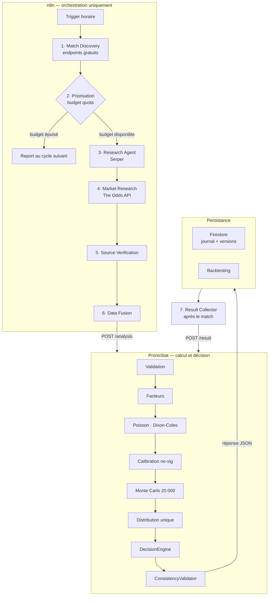

# Workflow n8n pour PronoStat — conception

Document de conception, sans modification du code. Il répond aux livrables
A à G, après inspection de l'existant.

---

## 0. Ce que l'inspection a révélé

Trois constats changent la conception. Ils sont exposés avant les livrables
parce qu'ils en déterminent la forme.

### 0.1 L'architecture demandée au §14 existe déjà, en Python

`agent/pipeline.py` enchaîne exactement les étapes du schéma demandé :

| Votre §14 | Module existant |
|---|---|
| ResearchAgent | `research.py` + `DataHub` (11 sources) |
| Data Validation | `agent/validation.py` |
| Feature Engineering | `agent/factors.py` |
| Statistical Models | `engine.py` — Poisson bivarié, Dixon-Coles |
| Market Calibration | `agent/market.py` — no-vig, mélange 60/40 |
| Monte Carlo | `engine.py` — 20 000 tirages |
| Unified Distribution | tableaux `home_goals` / `away_goals` |
| DecisionEngine | `agent/decision.py` |
| ConsistencyValidator | `engine.check_consistency()` |

S'y ajoutent trois modules que votre prompt ne prévoyait pas :
`contradictions.py`, `scenarios.py`, `introspection.py`.

**Conséquence : n8n ne doit rien réimplémenter.** Il orchestre *autour* du
moteur, exactement comme votre §2 le demande. Recréer ces agents dans n8n
produirait la « moyenne d'opinions » que votre §16 interdit.

### 0.2 Le quota de cotes est la contrainte qui commande tout

Chiffres relevés aujourd'hui : **269 requêtes restantes** sur 500 mensuelles.
Une récupération de cotes coûte **3 crédits** (h2h + totals + spreads).

Le rythme du §7 — J-7, J-3, J-1, quelques heures avant — appliqué à toutes
les compétitions donne :

| Périmètre | Affiches | × 4 cycles × 3 crédits | Verdict |
|---|---|---|---|
| Premier League seule | 10 | **120** | tenable |
| Football complet | ~100 | **1 200** | 2,4× le quota mensuel |
| Tous sports | ~180 | **2 160** | 4,3× le quota |

**La surveillance continue généralisée est impossible sur le palier
gratuit.** Ce n'est pas un détail d'implémentation : c'est le paramètre
central de la conception. Le workflow doit être *piloté par le quota*, pas
par le calendrier.

Deux endpoints échappent à cette limite et doivent être exploités sans
retenue : `/sports` et `/events` (calendriers) sont **gratuits**.

### 0.3 Aucune recherche web gratuite n'est disponible pour n8n

n8n n'embarque pas de moteur de recherche. Il faut un fournisseur. État du
marché vérifié ce jour :

| Fournisseur | Palier gratuit | Remarque |
|---|---|---|
| **Serper** | **2 500 requêtes/mois** | le plus généreux |
| Tavily | 1 000 crédits/mois | 1 crédit par recherche simple |
| Brave Search | supprimé en février 2026 | ~5 $ de crédits offerts |

Vos 10 recherches par match (§4) donnent **250 matchs/mois** avec Serper —
suffisant, à condition de ne pas multiplier par 4 cycles.

> Je n'ai **pas** d'outil de recherche web utilisable par le code de
> l'application. Celui dont je dispose est un outil d'assistant, il ne peut
> pas être appelé depuis Python ni depuis n8n. Toute conception qui
> supposerait le contraire serait fausse.

---

## A. Architecture



Règle de partage, à ne jamais enfreindre : **n8n cherche et structure,
PronoStat modélise et décide.** Aucun agent ne produit de pronostic.

---

## B. Les agents

Sept agents, pas huit : votre Agent 7 (Decision) et Agent 8 (Consistency)
existent déjà en Python et ne doivent surtout pas être dupliqués côté n8n.

### Agent 1 — Match Discovery

| | |
|---|---|
| **Entrée** | liste des 20 compétitions de `config.py` |
| **Traitement** | interroge `/events` de The Odds API, l'API NHL et TheSportsDB — **tous gratuits** ; déduplique par rapprochement flou de noms borné par la date |
| **Sortie** | `[{competition, home, away, starts_at, sources[]}]` |
| **Outils** | HTTP Request |
| **Coût** | **0 crédit** |

Ne détecte que les compétitions déjà activées. Aucune extension automatique.

### Agent 2 — Priorisation (ajout indispensable)

Cet agent ne figure pas dans votre prompt. Sans lui, le §7 épuise le quota
en quatre jours.

| | |
|---|---|
| **Entrée** | matchs découverts + quota restant + journal des analyses |
| **Traitement** | score de priorité = proximité du coup d'envoi × importance de la compétition × ancienneté de la dernière analyse ; alloue le budget du cycle |
| **Sortie** | sous-ensemble à analyser, avec le budget consenti |
| **Règle** | jamais plus de 20 % du quota mensuel restant sur un seul cycle |

### Agent 3 — Research Agent

| | |
|---|---|
| **Entrée** | un match retenu |
| **Traitement** | 6 à 10 recherches ciblées, adaptées au sport ; extraction structurée par un LLM |
| **Sortie** | `{form, injuries, context, standings}` avec source et horodatage par champ |
| **Outils** | Serper + nœud LLM |
| **Coût** | ~10 requêtes Serper |

Chaque champ porte un état : `disponible`, `non_trouve`, `non_publie`,
`source_inaccessible`, `contradictoire`. Jamais de valeur inventée.

### Agent 4 — Market Research Agent

| | |
|---|---|
| **Entrée** | un match retenu |
| **Traitement** | cotes via The Odds API ; conserve bookmaker, marché, cote, horodatage ; le consensus robuste (médiane + tolérance 6 %) reste calculé **côté PronoStat**, il y est déjà implémenté et testé |
| **Sortie** | `{markets, bookmaker_count, collected_at}` |
| **Coût** | **3 crédits** — le poste principal |

### Agent 5 — Source Verification

| | |
|---|---|
| **Traitement** | recoupe chaque information sensible sur ≥ 2 sources ; note fraîcheur et fiabilité ; **ne tranche jamais** une contradiction |
| **Sortie** | qualité par champ + liste des contradictions |

Exemple attendu : *Source A : joueur absent / Source B : disponible* →
`contradictoire`, transmis tel quel au moteur, qui baissera la confiance.

### Agent 6 — Data Fusion

| | |
|---|---|
| **Traitement** | déduplication, normalisation des noms d'équipes, vérification de la saison et des dates, conservation des horodatages et des sources |
| **Sortie** | le JSON du livrable D |

### Agent 7 — Result Collector

| | |
|---|---|
| **Déclencheur** | 6 h après le coup d'envoi théorique |
| **Traitement** | récupère le score final ; `POST /result` |
| **Note** | la logique existe déjà : `DataHub.final_score()` et `resolve_pending()` |

---

## C. Nœuds n8n

| # | Nœud | Type | Rôle |
|---|---|---|---|
| 1 | `Cron` | Schedule | toutes les 6 h |
| 2 | `Discover` | HTTP | calendriers gratuits |
| 3 | `Quota` | HTTP | `GET /quota` sur PronoStat |
| 4 | `Prioritise` | Code | budget du cycle |
| 5 | `Split` | SplitInBatches | un match à la fois |
| 6 | `Already fresh?` | IF | analyse < 24 h → saute |
| 7 | `Research` | HTTP Serper ×N | recherches ciblées |
| 8 | `Extract` | LLM | extraction structurée |
| 9 | `Odds` | HTTP | The Odds API |
| 10 | `Verify` | Code | recoupement, contradictions |
| 11 | `Fuse` | Code | dataset normalisé |
| 12 | `Analyse` | HTTP | `POST /analysis` |
| 13 | `Consistent?` | IF | bloque si `consistency` non vide |
| 14 | `Store` | Firestore | journal + versions |
| 15 | `Alert` | — | notification si incohérence |

Un second workflow, indépendant : `Cron 6 h` → `Pending` → `Fetch score` →
`POST /result` → `Backtest`.

---

## D. Schéma JSON

**`POST /analysis`**

```json
{
  "schema_version": "1.0",
  "event": {
    "sport": "football",
    "competition_key": "premier_league",
    "home": "Arsenal",
    "away": "Coventry City",
    "starts_at": "2026-08-21T19:00:00Z"
  },
  "research": {
    "form_home":  {"status": "disponible", "value": {...},
                   "sources": ["fbref"], "collected_at": "..."},
    "injuries":   {"status": "contradictoire",
                   "conflict": [{"source": "A", "claim": "absent"},
                                {"source": "B", "claim": "disponible"}]},
    "lineups":    {"status": "non_publie"}
  },
  "market": {
    "collected_at": "...",
    "bookmakers": [{"name": "Bet365", "h2h": {"home": 1.16, "draw": 7.6,
                                              "away": 17.0}}]
  },
  "versions": {"research_version": "1.0", "data_timestamp": "..."}
}
```

Le champ `status` est obligatoire partout : c'est lui qui distingue les cinq
états du §9. Une valeur absente sans `status` doit être **rejetée**.

**Réponse** : `{analysis_id, model_version, main_pick, outcome_probs,
markets, top_scores, pick_scores, confidence, consistency[], sources[]}`.

**`POST /result`** : `{analysis_id, home_goals, away_goals, finished_at}`.

---

## E. Erreurs et replis

| Défaillance | Repli |
|---|---|
| Serper indisponible | analyse sur les seules sources internes, confiance abaissée |
| Quota de cotes épuisé | repère de saison, badge explicite — jamais de cote inventée |
| PronoStat injoignable | 3 tentatives espacées, puis report au cycle suivant |
| `consistency` non vide | **publication bloquée**, alerte |
| Score introuvable | reste « en attente », jamais compté comme échec |
| Sources contradictoires | transmis tel quel, confiance abaissée |

Principe : **une donnée manquante n'empêche jamais l'analyse** de tourner
sur les autres. Elle abaisse la confiance.

---

## F. Déploiement

| Composant | Hébergement | Coût | Limite |
|---|---|---|---|
| PronoStat | Streamlit Cloud *(en place)* | 0 € | pas d'API HTTP |
| API PronoStat | **à créer** — FastAPI sur Fly.io ou Render | 0 € | s'endort à l'inactivité |
| n8n | n8n Cloud gratuit ou auto-hébergé Docker | 0 € / VPS ~5 € | 5 workflows actifs |
| Firestore | *(en place)* | 0 € | 50 k lectures/jour |
| Serper | inscription | 0 € | 2 500 req./mois |

**Point d'attention** : Streamlit ne peut pas exposer `POST /analysis`. Il
faut un service HTTP distinct qui importe le même code — `agent/`,
`engine.py`, `data_sources.py` sont déjà des modules autonomes, aucune
réécriture n'est nécessaire.

---

## G. Plan d'implémentation

Chaque étape est testable seule et utile même si l'on s'arrête là.

| Étape | Contenu | Effort | Vérification |
|---|---|---|---|
| **1** | API FastAPI : `POST /analysis`, `GET /analysis/{id}`, `POST /result`, `GET /quota` | 1 j | tests d'intégration |
| **2** | Versioning : `model_version`, `research_version` dans le journal | 0,5 j | relire une analyse archivée |
| **3** | Workflow n8n minimal : Discovery → Prioritise → Analyse → Store, **sans recherche web** | 1 j | tourne 3 jours sans dépasser le quota |
| **4** | Workflow résultats + backtesting (Brier, log loss, calibration) | 1 j | rejouer l'historique Firestore |
| **5** | Serper + extraction LLM, sur **une** compétition | 1,5 j | comparer confiance avec et sans |
| **6** | Verification et contradictions | 1 j | cas de test contradictoire |
| **7** | Extension progressive des compétitions, sous surveillance du quota | — | quota jamais dépassé |

L'étape 3 avant l'étape 5 est délibérée : elle valide l'orchestration et le
budget avant d'ajouter la couche coûteuse.

---

## Ce que je recommande de ne pas faire

**Ne pas surveiller les 20 compétitions en continu.** Le quota l'interdit,
et la valeur marginale d'une quatrième actualisation est faible face à une
première analyse sur un match non couvert.

**Ne pas faire produire de pronostic aux agents LLM**, même « pour
comparer ». Le §16 est la bonne règle, et le moteur actuel la respecte.

**Ne pas commencer par les agents.** L'API HTTP (étape 1) est le vrai
prérequis : sans elle, aucun workflow n8n ne peut parler au moteur.

---

Sources consultées pour les paliers gratuits :
[Brave Search API 2026](https://agentdeals.dev/vendor/brave-search-api) ·
[Tavily pricing](https://costbench.com/software/web-scraping/tavily/) ·
[Serper alternatives](https://www.scrapingdog.com/blog/serper-alternatives/)
